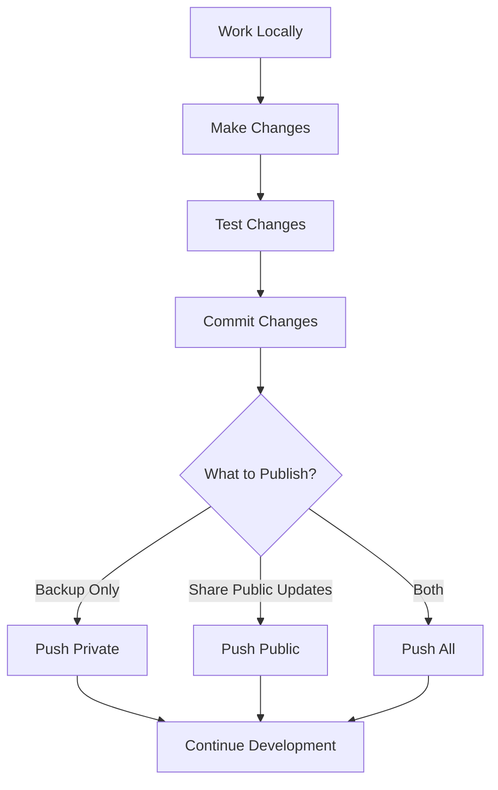

# Dual-Repository Workflow Guide

This guide explains how to work with the SRE Masterclass dual-repository setup that separates public application code from private course content.

## 📁 Repository Structure Overview

### **Single Local Repository** → **Two Remote Repositories**

```
Local: sre-masterclass/
├── Public Content (goes to both repos)
│   ├── services/          # Application code
│   ├── monitoring/        # Monitoring stack
│   ├── entropy-engine/    # Chaos engineering
│   ├── entropy-dashboard/ # Chaos dashboard
│   ├── docs/design/       # Technical documentation
│   ├── docs/development/  # Development guides
│   └── scripts/           # Utility scripts
│
└── Private Content (only in private repo)
    └── course/
        ├── video-scripts/    # Course video content
        ├── production/       # Content creation materials
        └── planning/         # Project planning docs
```

### **Remote Repositories**
- **Public**: `https://github.com/sre-masterclass/sre-masterclass.git`
- **Private**: `https://github.com/sre-masterclass/sre-masterclass-private.git`

## 🚀 Daily Workflow

### **1. Normal Development**
Work normally with all content in your local repository:

```bash
# Make changes to any files
vim services/ecommerce-api/main.py
vim course/video-scripts/new-module.md

# Commit as usual
git add .
git commit -m "Add new feature and course content"
```

### **2. Publishing Changes**

#### **Option A: Push to Private Only** (Backup all content)
```bash
bash scripts/git-push-private.sh
```

#### **Option B: Push to Public Only** (Share application updates)
```bash
# RECOMMENDED: Use the safer version
bash scripts/git-push-public-safe.sh

# OR: Original version (has file deletion risk)
bash scripts/git-push-public.sh
```

#### **Option C: Push to Both** (Recommended for most updates)
```bash
# RECOMMENDED: Use the safer version
bash scripts/git-push-all-safe.sh

# OR: Original version (has file deletion risk)
bash scripts/git-push-all.sh
```

#### **⚠️ IMPORTANT SAFETY NOTE**
The original `git-push-public.sh` script has a risk of accidentally deleting files if the push operation fails. The new `-safe` versions eliminate this risk by using git worktrees instead of temporary branches.

## 🔧 Detailed Workflows

### **Development Workflow**



### **Branch Management**

**Recommended branching strategy:**
```bash
# Create feature branch
git checkout -b feature/new-slo-implementation

# Work on both public and private content
# ... make changes ...

# Commit changes
git commit -m "Implement new SLO features and course content"

# Switch to main and merge
git checkout main
git merge feature/new-slo-implementation

# Push to repositories
bash scripts/git-push-all.sh
```

### **Content Type Guidelines**

| Content Type | Location | Visibility |
|-------------|----------|------------|
| Application code | `services/`, `monitoring/`, etc. | Public |
| Technical docs | `docs/design/`, `docs/development/` | Public |
| Video scripts | `course/video-scripts/` | Private |
| Course planning | `course/planning/` | Private |
| Production workflows | `course/production/` | Private |

## 🛠️ Setup Commands Reference

### **Initial Setup** (One-time)
```bash
# Add remotes
git remote add public https://github.com/sre-masterclass/sre-masterclass.git
git remote add private https://github.com/sre-masterclass/sre-masterclass-private.git

# Configure aliases (optional)
git config alias.push-public '!bash scripts/git-push-public.sh'
git config alias.push-private '!bash scripts/git-push-private.sh'
git config alias.push-all '!bash scripts/git-push-all.sh'
```

### **Verification Commands**
```bash
# Check remotes
git remote -v

# Check current branch
git branch

# Check status
git status

# Verify no uncommitted changes before pushing
git diff-index --quiet HEAD --
```

## 🔒 Security Features

### **Automated Protection**
1. **Pre-push Hook**: Prevents direct pushes of private content to public repo
2. **Filtering Scripts**: Automatically remove private directories before public push
3. **GitHub Actions**: Continuous validation of public repository content

### **Protected Directories**
The following directories are automatically filtered from public pushes:
- `course/`
- `docs/video_scripts/` (legacy)
- `docs/content-production/` (legacy)  
- `docs/planning/` (legacy)

## 📋 Common Scenarios

### **Adding New Public Documentation**
```bash
# Create documentation
vim docs/design/new-architecture.md

# Commit and push to both repos
git add docs/design/new-architecture.md
git commit -m "Add new architecture documentation"
bash scripts/git-push-all.sh
```

### **Adding New Course Content**
```bash
# Create course content
vim course/video-scripts/module-3-advanced-topics.md

# Commit and push to private only
git add course/video-scripts/module-3-advanced-topics.md
git commit -m "Add advanced topics module"
bash scripts/git-push-private.sh
```

### **Mixed Changes (Application + Course)**
```bash
# Make changes to both public and private content
vim services/auth-api/main.py
vim course/video-scripts/auth-module.md

# Commit everything
git add .
git commit -m "Update auth service and related course content"

# Push to both repositories
bash scripts/git-push-all.sh
```

### **Handling Merge Conflicts**
```bash
# If conflicts occur during merge
git status
# Resolve conflicts in affected files
git add resolved-files
git commit -m "Resolve merge conflicts"

# Then push normally
bash scripts/git-push-all.sh
```

## 🚨 Emergency Procedures

### **If Private Content Accidentally Pushed to Public**
1. **Immediate action**: Contact GitHub support to remove sensitive data
2. **Force push clean version**:
   ```bash
   bash scripts/git-push-public.sh
   ```
3. **Review workflow** to prevent future incidents

### **If Push Scripts Fail**
1. **Check you're on main branch**: `git branch`
2. **Ensure clean working directory**: `git status`
3. **Verify remotes exist**: `git remote -v`
4. **Check script permissions**: `ls -la scripts/git-push-*.sh`

### **Recovery from Corrupted State**
```bash
# Reset to known good state
git fetch private main
git reset --hard private/main

# Clean working directory
git clean -fd

# Retry push
bash scripts/git-push-all.sh
```

## 🎯 Best Practices

### **DO:**
- ✅ Always use provided scripts for pushing to public repository
- ✅ Keep private content in `course/` directory
- ✅ Commit regularly with descriptive messages
- ✅ Test locally before pushing
- ✅ Use feature branches for significant changes

### **DON'T:**
- ❌ Never use `git push public main` directly
- ❌ Don't put course content outside `course/` directory
- ❌ Don't force push without understanding implications
- ❌ Don't ignore pre-push hook warnings
- ❌ Don't work directly on main branch for large changes

## 📞 Troubleshooting

### **Script Permission Errors**
```bash
chmod +x scripts/git-push-*.sh
chmod +x .git/hooks/pre-push
```

### **"No upstream configured" Error**
```bash
git branch --set-upstream-to=private/main main
```

### **"Remote not found" Error**
```bash
# Check remotes exist
git remote -v

# Add missing remote
git remote add private https://github.com/sre-masterclass/sre-masterclass-private.git
```

### **Verification Commands**
```bash
# Check what would be pushed to public
git log public/main..HEAD --oneline

# Check what would be pushed to private  
git log private/main..HEAD --oneline

# List files that would be affected
git diff --name-only public/main..HEAD
```

## 📚 Additional Resources

- **Quick Commands**: See `git-commands-cheatsheet.md`
- **Security Checklist**: See `security-checklist.md`
- **Repository Setup**: See `REPOSITORY_SETUP.md` (in root)
- **Course Content Guide**: See `course/README.md`

---

**Last Updated**: July 2025  
**Version**: 1.0
