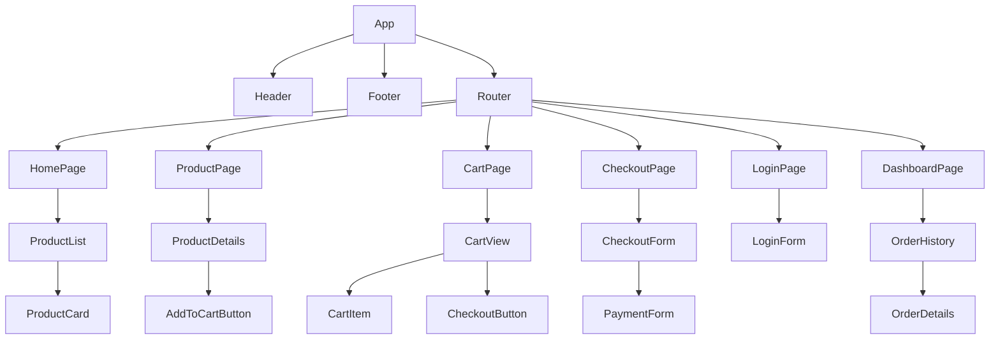

# Frontend Development Plan

## 1. Overview

This document outlines the plan for developing the React-based frontend for the SRE Masterclass project. The frontend will provide a user interface for the e-commerce platform, allowing users to browse products, manage their shopping cart, and complete purchases.

## 2. Component Architecture

This section defines the React component hierarchy. We will use a modular approach to create reusable and maintainable components. The following diagram illustrates the proposed component structure:



**Component Descriptions:**

*   **App**: The root component of the application.
*   **Header**: The application header, containing navigation links and the shopping cart icon.
*   **Footer**: The application footer.
*   **Router**: Manages application routing.
*   **HomePage**: The main landing page, displaying a list of products.
*   **ProductList**: A component that fetches and displays a list of products.
*   **ProductCard**: A component that displays a single product.
*   **ProductPage**: The product detail page.
*   **ProductDetails**: A component that displays the details of a single product.
*   **AddToCartButton**: A button to add a product to the shopping cart.
*   **CartPage**: The shopping cart page.
*   **CartView**: A component that displays the contents of the shopping cart.
*   **CartItem**: A component that displays a single item in the shopping cart.
*   **CheckoutButton**: A button to proceed to the checkout page.
*   **CheckoutPage**: The checkout page.
*   **CheckoutForm**: A form for users to enter their shipping and payment information.
*   **PaymentForm**: A form for users to enter their payment details.
*   **LoginPage**: The user login page.
*   **LoginForm**: A form for users to enter their credentials.
*   **DashboardPage**: The user dashboard page.
*   **OrderHistory**: A component that displays the user's order history.
*   **OrderDetails**: A component that displays the details of a single order.

## 3. API Integration

This section details how the frontend communicates with the backend services. We will define API endpoints, request/response formats, and error handling strategies.

### E-commerce Service (`ecommerce-api`)

The `ecommerce-api` service is responsible for managing products, the shopping cart, and orders.

**Products**

*   **`GET /api/products`**: Fetches a list of all products.
*   **`GET /api/products/{productId}`**: Fetches a single product by its ID.

**Shopping Cart**

*   **`GET /api/cart`**: Fetches the current user's shopping cart.
*   **`POST /api/cart/items`**: Adds a product to the shopping cart.
*   **`PUT /api/cart/items/{itemId}`**: Updates the quantity of an item in the cart.
*   **`DELETE /api/cart/items/{itemId}`**: Removes an item from the cart.

**Orders**

*   **`POST /api/orders`**: Creates a new order from the current cart.
*   **`GET /api/orders`**: Fetches a list of the current user's orders.
*   **`GET /api/orders/{orderId}`**: Fetches a single order by its ID.

## 4. State Management

This section describes our approach to managing application state. We will use a combination of **Redux Toolkit** for global state and **React's Context API** for more localized state.

### Redux Toolkit (Global State)

For application-wide state that is accessed and modified by many components, we will use Redux Toolkit. This includes:

*   **Shopping Cart**: The contents of the user's shopping cart, including items and quantities.
*   **User Session**: The current user's authentication status and profile information.
*   **Products Cache**: Caching product data to avoid redundant API calls.

**Justification**: Redux Toolkit provides a centralized store for our application's state, making it predictable and easy to debug. Its "slice" pattern helps organize our logic, and the Redux DevTools extension provides powerful debugging capabilities.

### React Context API (Local State)

For state that is only relevant to a specific part of the component tree, we will use React's Context API. This avoids the boilerplate of Redux for simpler use cases. Examples include:

*   **Theme**: The current UI theme (e.g., light/dark mode).
*   **UI State**: State related to the UI of a specific component, such as whether a modal is open or closed.

This hybrid approach allows us to leverage the strengths of both solutions, resulting in a more maintainable and scalable application.

## 5. Styling

This section outlines our strategy for styling the application. We will use **Tailwind CSS**, a utility-first CSS framework, to ensure a consistent and maintainable design system.

### Why Tailwind CSS?

*   **Rapid Prototyping and Development**: Utility classes allow us to build complex interfaces without writing custom CSS, speeding up the development cycle.
*   **Enforced Consistency**: By using a predefined design system (colors, spacing, typography), we ensure visual consistency across the entire application.
*   **Highly Customizable**: We can configure Tailwind to match our specific design requirements, including our own color palette and fonts.
*   **Optimized for Production**: Tailwind automatically removes unused styles in production builds, resulting in the smallest possible CSS file.

### Basic Design System

We will start with a simple design system defined in our `tailwind.config.js` file.

*   **Colors**:
    *   `primary`: `#007BFF` (Blue)
    *   `secondary`: `#6C757D` (Gray)
    *   `success`: `#28A745` (Green)
    *   `danger`: `#DC3545` (Red)
    *   `light`: `#F8F9FA` (Light Gray)
    *   `dark`: `#343A40` (Dark Gray)
*   **Typography**:
    *   **Font Family**: We will use a standard sans-serif font stack for now.
    *   **Font Sizes**: We will use Tailwind's default responsive font sizes.
*   **Spacing**: We will use Tailwind's default spacing scale for margins, padding, and layout.

## 6. Vite Configuration

The project has been migrated from Create React App to Vite to leverage its fast development server and optimized build process.

### Key Configuration (`vite.config.js`)

The `vite.config.js` file is configured to:
- Use the `@vitejs/plugin-react` for React support.
- Proxy API requests to the backend services to avoid CORS issues during development.
- Define the server port and enable Hot Module Replacement (HMR).

### Docker Setup

The `services/frontend/Dockerfile` has been updated to use a multi-stage build process suitable for a Vite application. It first builds the static assets using a Node.js image and then serves them using a lightweight Nginx server.

The `docker-compose.yml` file has been updated to expose the Vite development server on port `3002`, mapping to the container's port `5173`.

## 7. Real-time Updates

This section details the plan for implementing real-time features, such as order status updates. We will use **WebSockets** to provide a responsive and engaging user experience.

### WebSocket Architecture

1.  **Backend (`ecommerce-api`)**:
    *   The `ecommerce-api` service will host a WebSocket server.
    *   A new endpoint, `/ws/orders/{orderId}`, will be created to handle WebSocket connections for specific orders.
    *   When an order's status is updated (e.g., by the `job-processor` service), a message will be published to the corresponding WebSocket connection.

2.  **Frontend**:
    *   After a user places an order, the frontend will initiate a WebSocket connection to `/ws/orders/{orderId}`.
    *   The frontend will listen for incoming messages and update the UI accordingly, providing real-time feedback to the user.
    *   We will use a library like `socket.io-client` or a custom hook to manage the WebSocket connection.

### Message Format

The messages sent over the WebSocket connection will be in JSON format and will contain the new order status:

```json
{
  "order_id": "string",
  "status": "string"
}
```

## 8. User Authentication

This section describes the frontend implementation of user authentication and session management. We will use a **token-based authentication** system, with the `auth-api` service acting as the identity provider.

### Authentication Flow

1.  **Login**: The user enters their credentials into the `LoginForm` component.
2.  **Token Request**: The frontend sends a `POST` request to the `auth-api` service at `/api/auth/token`.
    *   **Request Body**: `username` and `password`.
3.  **Token Response**: If the credentials are valid, the `auth-api` service returns a JSON Web Token (JWT).
4.  **Token Storage**: The frontend will store the JWT in an `HttpOnly` cookie to protect it from XSS attacks. This will be handled automatically by the browser.
5.  **Authenticated Requests**: The browser will automatically include the JWT in the `Authorization` header for all subsequent requests to protected API endpoints.
6.  **Logout**: To log out, the frontend will send a request to an `/api/auth/logout` endpoint, which will invalidate the cookie.

### Registration

*   A `RegistrationForm` component will allow new users to create an account.
*   This form will send a `POST` request to `/api/auth/register` with the user's details.

### Protected Routes

*   We will use a higher-order component (HOC) or a custom hook to create protected routes that are only accessible to authenticated users.
*   If an unauthenticated user tries to access a protected route, they will be redirected to the `LoginPage`.

## 9. Development Roadmap

This section provides a high-level timeline for the development of the frontend, broken down into the following milestones.

*   **Milestone 1: Project Setup & Foundation (Completed)**
    *   Migrated the project from Create React App to Vite.
    *   Integrated Tailwind CSS for styling.
    *   Set up Redux Toolkit for state management.
    *   Created the main application layout, including the `Header`, `Footer`, and `Router`.
    *   Implemented the `HomePage` with a `ProductList` component to display products from the `ecommerce-api`.

*   **Milestone 2: Core E-commerce Features (Completed)**
    *   Developed the `ProductPage` to show detailed information for a single product.
    *   Implemented the shopping cart functionality, including the `CartPage`, `CartView`, and `AddToCartButton`.
    *   Connected the cart to the `ecommerce-api` to manage its state.

*   **Milestone 3: Checkout & Orders (Completed)**
    *   Built the `CheckoutPage` and `CheckoutForm` to collect user information.
    *   Integrated with the `payment-api` to process payments.
    *   Implemented the order creation flow and the `DashboardPage` to display `OrderHistory`.

*   **Milestone 4: User Authentication & Real-time Updates (Completed)**
    *   Implemented the `LoginPage` and `RegistrationForm` to manage user authentication.
    *   Secured the application with protected routes.
    *   Integrated WebSockets for real-time order status updates.
